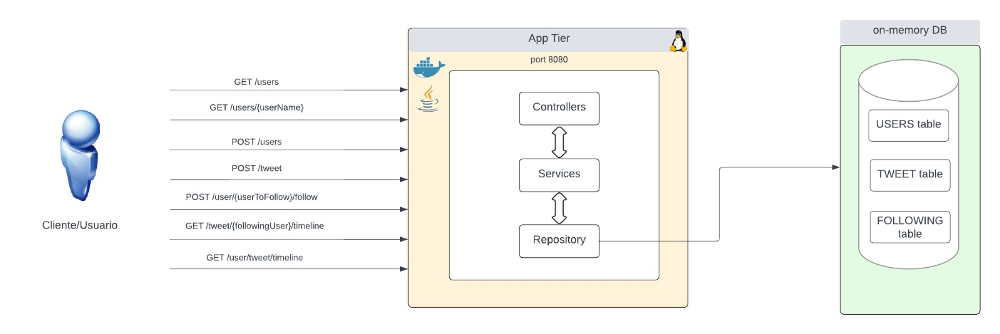

Microblogging application
======================================

**Intro**

Aplicación de microblogging similar a twitter que
permite a los usuarios publicar, seguir y ver el timeline de tweets.

**Pre Requisitos**
--------

- Para levantar localmente la aplicación, se necesita tener los siguentes
  programas instalados

    - Instalar git: https://gist.github.com/derhuerst/1b15ff4652a867391f03
      <br />
    - Instalar Maven: https://www.baeldung.com/install-maven-on-windows-linux-mac
      <br />
    - Instalar java: https://www.java.com/en/download/help/index_installing.html
      <br />  <br />

  En el caso de querer generar una imagen local y correr un contenedor:

    - Instalar Docker: https://docs.docker.com/engine/install/
      <br />  <br />

    - Clonar Aplicación
      <br />  <br />
      git@github.com:mgrellet/microblogging.git

**Estructura de projecto**
----------
**Controller** - Contiene los endpoints de la aplicación.

**Model** - Contiene los modelos de negocio.

**Repository** - Layer de acceso a datos. Actualmente se usa base de datos H2DB (in-memory)

**Service** - Layer con la lógica de negocio.

**Dto** - Data transfer object.

**Exception** - Contiene Custom Exceptions para la aplicación
<br /><br />

**Diagrama de la aplicación**
---------------------------------------

<br /><br />

**Funcionalidad**
---------------------------------------

- Creacion de usuario
- Listar usuarios de la aplicación
- Lista de info de un usuario individualmente
- Creación de Tweet
- Seguir usuario
- Timeline de un usuario
- Timeline general de usuarios que se siguen

**Como correr la aplicacón localmente (el caso de que se requiera)**
--------

- Para correr la aplicacíon localmente, se necesita previamente maven y java 17 instalados.
  <br /><br />

- Para correr la aplicación como un "standalone service", se necesita ir a la carpeta del
  del projecto y correr:
  <br /><br />
  **mvn clean package**
  <br /><br />
  Luego correr:
  <br /><br />
  **java -jar target/microblogging-0.0.1.jar --spring.config.location=/path/to/your/properties/application.properties**
  <br /><br />

- Para correr la aplicación usando Docker, se debe ir al directorio previamente clonado y correr:
  <br /><br />
  **mvn clean package** para generar el archivo .jar
  <br /><br />
- Luego:
  <br /><br />
  **docker-compose build**
  <br /><br />
  Luego correr:
  <br /><br />
  **docker-compose up**
  <br /><br />

**Ejecución de la aplicación**
---------------------------------------

<i>NOTA: Aplicación desplegada en donweb.com </i>

Swagger link: http://vps-4084159-x.dattaweb.com:8080/swagger-ui/index.html
<br>
Swagger link local: https://localhost:8080/swagger-ui/index.html
<br>
**postman collection**
<i>Nota: La colección apunta a localhost:8080</i>
[Download collection.json](https://raw.githubusercontent.com/mgrellet/microblogging/main/assets/microblogging.postman_collection.json)

0) Ver archivo business.txt para conocer assumtions

1) <u>Traer lista de usuarios existente</u>
   <i>Nota: Para propósitos de testing se crea un usuario de test al iniciar la app
   llamado "@user1"</i>

Local

```bash
curl -X 'GET' 'http://localhost:8080/users' -H 'accept: application/json'
```

Remoto

```bash
curl -X 'GET' 'http://vps-4084159-x.dattaweb.com:8080/users' -H 'accept: application/json'
```

2) <u>Crear usuario</u>, por ejemplo "@user2"

local

```bash
curl -X 'POST' 'http://localhost:8080/users' -H 'accept: application/json' -H 'Content-Type: application/json' -d '{"userName": "@user2"}'
```

Remoto

```bash
curl -X 'POST' 'http://vps-4084159-x.dattaweb.com:8080/users' -H 'accept: application/json' -H 'Content-Type: application/json' -d '{"userName": "@user2"}'
```

3) <u>Obtener datos de usuario</u> (podemos ver el usuario recien creado)

local

```bash
curl -X 'GET' 'http://localhost:8080/users/@user2'  -H 'accept: application/json'
```

Remoto

```bash
curl -X 'GET' 'http://vps-4084159-x.dattaweb.com:8080/users/@user2'  -H 'accept: application/json'
```

4) <u>Seguir usuario:</u>
   <i>Nota: Asumiendo que somos el @user1 y queremos seguir al @user2 recien creado
   , debemos pasar por header como x-app-user nuestro usuario y como path param el
   usuario que queremos seguir</i>

local

```bash
curl -X 'POST' 'http://localhost:8080/users/@user2/follow' -H 'accept: application/json' -H 'x-app-user: @user1' -d ''
```

Remoto

```bash
curl -X 'POST' 'http://vps-4084159-x.dattaweb.com:8080/users/@user2/follow' -H 'accept: application/json' -H 'x-app-user: @user1' -d ''
```

5) <u>Creación de tweet:</u>
   <i>Digamos que el @user2, usuario a quien @user1 sigue, crea un tweet, se deberia
   pasar por header x-app-user el user quien esta creando el tweet, en este caso @user2</i>

local

```bash
curl -X 'POST' 'http://localhost:8080/tweet' -H 'accept: application/json' -H 'x-app-user: @user2' -H 'Content-Type: application/json' -d '{"tweet": "Este es un tweet"}'
```

Remoto

```bash
curl -X 'POST' 'http://vps-4084159-x.dattaweb.com:8080/tweet' -H 'accept: application/json' -H 'x-app-user: @user2' -H 'Content-Type: application/json' -d '{"tweet": "Este es un tweet"}'
```

6) <u>Timeline de usuario:</u>
   <i>Si el usuario @user1, que sigue a @user2 quiere ver el timeline de sus tweets,
   se debe pasar por path param el usuario a quien sigo (@user2), y como header el usuario (@user1
   por ejemplo):</i>

local

```bash
curl -X 'GET' 'http://localhost:8080/tweet/@user2/timeline' -H 'accept: application/json' -H 'x-app-user: @user1'
```

Remoto

```bash
curl -X 'GET' 'http://vps-4084159-x.dattaweb.com:8080/tweet/@user2/timeline' -H 'accept: application/json' -H 'x-app-user: @user1'
```

7) <u>Timeline general:</u>
   <i>Si el usuario quiere ver un timeline de todos los tweets de todos los usuarios que sigue
   debe llamar al siguente endpoint, como header x-app-user, por ejemplo @user1:</i>

local

```bash
curl -X 'GET' 'http://localhost:8080/tweet/timeline' -H 'accept: application/json' -H 'x-app-user: @user1'
```

Remoto

```bash
curl -X 'GET' 'http://vps-4084159-x.dattaweb.com:8080/tweet/timeline' -H 'accept: application/json' -H 'x-app-user: @user1'
```
