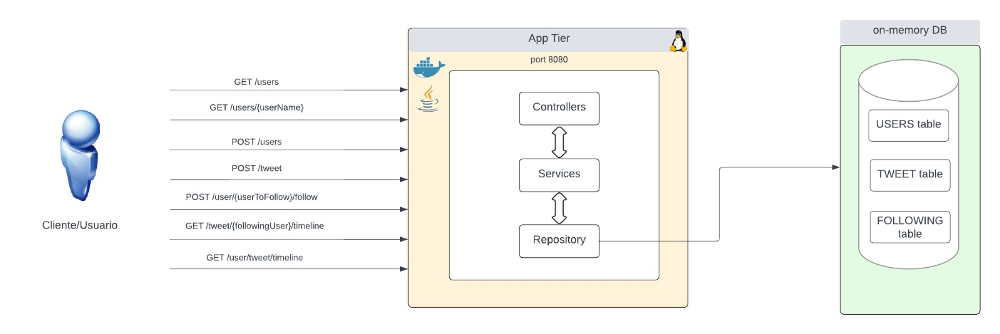

Microblogging application
======================================

**Intro**

Aplicación de microblogging similar a twitter que
permite a los usuarios publicar, seguir y ver el timeline de tweets.

**Pre Requisitos**
--------
- Para levantar localmente la aplicación, se necesita tener los siguentes
programas instalados
   
  - Instalar git: https://gist.github.com/derhuerst/1b15ff4652a867391f03
     
  - Instalar Maven: https://www.baeldung.com/install-maven-on-windows-linux-mac
     
  - Instalar java: https://www.java.com/en/download/help/index_installing.html
        
  
  En el caso de querer generar una imagen local y correr un contenedor:

    - Instalar Docker: https://docs.docker.com/engine/install/
        

    - Clonar Aplicación
        
      git@github.com:mgrellet/microblogging.git

**Estructura de projecto**
----------
**Controller** - Contiene los endpoints de la aplicación.

**Model** - Contiene los modelos de negocio.

**Repository** - Layer de acceso a datos. Actualmente se usa base de datos H2DB (in-memory) 

**Service** - Layer con la lógica de negocio.

**Dto** - Data transfer object to be retrieved.

**Exception** - Contiene Custom Exceptions para la aplicación

**Como correr la aplicacón localmente**
--------
- Para correr la aplicacíon localmente, se necesita previamente maven y java 17 instalados.
    

- Para correr la aplicación como un "standalone service", se necesita ir a la carpeta del 
del projecto y correr:
    
  **mvn clean package**
    
  Luego correr:
    
  **java -jar target/microblogging-0.0.1.jar --spring.config.location=/path/to/your/properties/application.properties**
    
     
- Para correr la aplicación usando Docker, se debe ir al directorio previamente clonado y correr:
    
  **docker-compose build**
    
  Luego correr:
    
  **docker-compose up**
    

**Diagrama de la aplicación**
---------------------------------------

  

**Funcionalidad**
---------------------------------------

- Creacion de usuario
- Lista de usuarios de la aplicación
- Lista de info de un usuario
- Creación de Tweet
- Seguir usuario
- Timeline de un usuario
- Timeline de usuarios que se siguen
